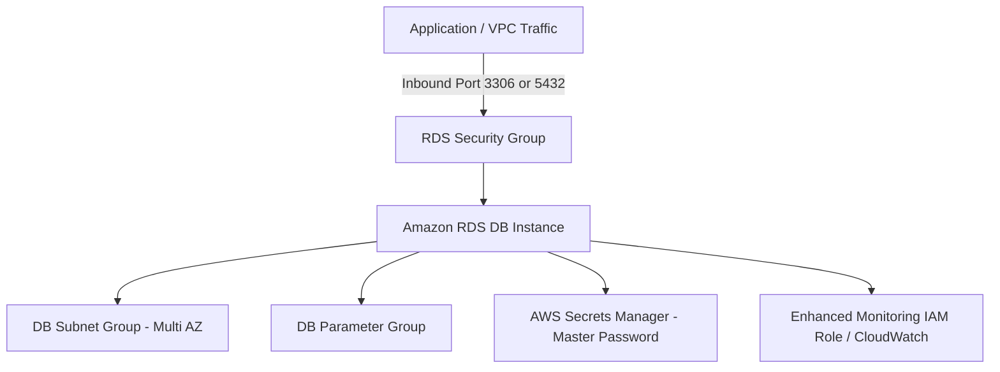

# AWS RDS Terraform Module

A production-ready Terraform module to deploy and manage Amazon Relational Database Service (RDS) instances supporting **MySQL** and **PostgreSQL** engines with comprehensive security, high availability, backup, and monitoring options.

All resources are consolidated into a unified `main.tf` for seamless maintenance and clean dependency orchestration.

---

## Features

- **Multi-Engine Support**: Pre-configured defaults and automated parameter/port selection for **MySQL** (default port `3306`, family `mysql8.0`) and **PostgreSQL** (default port `5432`, family `postgres16`).
- **AWS Secrets Manager Integration**: Native support for `manage_master_user_password = true` to automatically generate and rotate credentials via AWS Secrets Manager.
- **DB Subnet Group**: Automatic creation of DB subnet group across multiple Availability Zones or association with existing subnet groups.
- **Custom Parameter Groups**: Configurable parameter groups with custom engine family parameters.
- **Option Groups**: Support for optional DB option groups (e.g., MariaDB audit plugin, native extensions).
- **Dedicated Security Group**: Optional automated creation of security groups with fine-grained inbound rules for CIDRs and referenced security groups.
- **Enhanced Monitoring**: Automatic creation of IAM role and policy attachment for CloudWatch Enhanced Monitoring.
- **Storage Autoscaling**: Provisioned `gp3` storage with optional autoscaling up to `max_allocated_storage`.
- **High Availability & Backups**: Automated backups, retention period controls, maintenance windows, Multi-AZ, and final snapshot protections.

---

## Architecture Diagram



---

## Usage Examples

### 1. MySQL Instance

```hcl
module "rds_mysql" {
  source = "../../modules/aws/rds"

  identifier     = "my-mysql-db"
  engine         = "mysql"
  engine_version = "8.0.35"
  instance_class = "db.t4g.micro"

  allocated_storage     = 20
  max_allocated_storage = 100
  storage_type          = "gp3"

  db_name                     = "ecommerce"
  username                    = "dbadmin"
  manage_master_user_password = true

  vpc_id                = "vpc-0123456789abcdef0"
  subnet_ids            = ["subnet-0123456789abcdef0", "subnet-0fedcba9876543210"]
  allowed_cidr_blocks   = ["10.0.0.0/16"]

  multi_az            = false
  skip_final_snapshot = true

  enabled_cloudwatch_logs_exports = ["error", "general", "slowquery"]

  tags = {
    Environment = "production"
    Terraform   = "true"
  }
}
```

### 2. PostgreSQL Instance with Multi-AZ

```hcl
module "rds_postgres" {
  source = "../../modules/aws/rds"

  identifier     = "my-postgres-db"
  engine         = "postgres"
  engine_version = "16.1"
  instance_class = "db.t4g.small"

  allocated_storage     = 50
  max_allocated_storage = 200
  storage_type          = "gp3"

  db_name                     = "analytics"
  username                    = "postgres"
  manage_master_user_password = true

  vpc_id              = "vpc-0123456789abcdef0"
  subnet_ids          = ["subnet-0123456789abcdef0", "subnet-0fedcba9876543210"]
  allowed_cidr_blocks = ["10.0.0.0/16"]

  multi_az                = true
  deletion_protection     = true
  backup_retention_period = 14
  skip_final_snapshot     = false

  monitoring_interval    = 60
  create_monitoring_role = true

  create_db_parameter_group = true
  family                    = "postgres16"
  parameters = [
    {
      name  = "log_min_duration_statement"
      value = "1000"
    }
  ]

  enabled_cloudwatch_logs_exports = ["postgresql", "upgrade"]

  tags = {
    Environment = "production"
    Terraform   = "true"
  }
}
```

---

## Requirements

| Name | Version |
|------|---------|
| terraform | >= 1.5.0 |
| aws | >= 5.0 |

---

## Inputs

| Name | Description | Type | Default | Required |
|------|-------------|------|---------|:--------:|
| identifier | The name of the RDS instance | `string` | n/a | yes |
| engine | The database engine (`mysql`, `postgres`, `mariadb`) | `string` | `"mysql"` | no |
| engine_version | Database engine version | `string` | `null` | no |
| instance_class | RDS instance type | `string` | `"db.t4g.micro"` | no |
| allocated_storage | Allocated storage in GB | `number` | `20` | no |
| max_allocated_storage | Upper limit for storage autoscaling in GB | `number` | `100` | no |
| storage_type | Storage type (`gp3`, `gp2`, `io1`, `io2`) | `string` | `"gp3"` | no |
| storage_encrypted | Whether storage encryption is enabled | `bool` | `true` | no |
| kms_key_id | KMS Key ARN for storage encryption | `string` | `null` | no |
| db_name | Name of the database to create | `string` | `null` | no |
| username | Master username | `string` | `null` | no |
| password | Master password (when manage_master_user_password is false) | `string` | `null` | no |
| manage_master_user_password | Manage password with AWS Secrets Manager | `bool` | `true` | no |
| master_user_secret_kms_key_id | KMS Key for Secrets Manager master user secret | `string` | `null` | no |
| port | Port for DB connections (3306 for MySQL, 5432 for Postgres) | `number` | `null` | no |
| multi_az | Whether instance is Multi-AZ | `bool` | `false` | no |
| publicly_accessible | Whether instance is publicly accessible | `bool` | `false` | no |
| vpc_id | VPC ID for dedicated security group | `string` | `null` | no |
| subnet_ids | VPC Subnet IDs for DB subnet group | `list(string)` | `[]` | no |
| allowed_cidr_blocks | Ingress CIDR blocks for DB port | `list(string)` | `[]` | no |
| allowed_security_group_ids | Ingress Security Group IDs for DB port | `list(string)` | `[]` | no |
| backup_retention_period | Retention period in days (0-35) | `number` | `7` | no |
| skip_final_snapshot | Skip snapshot before deletion | `bool` | `true` | no |
| deletion_protection | Protect from accidental deletion | `bool` | `false` | no |
| monitoring_interval | Enhanced monitoring interval in seconds | `number` | `0` | no |
| create_monitoring_role | Automatically create IAM role for monitoring | `bool` | `false` | no |
| tags | Resource tags | `map(string)` | `{}` | no |

---

## Outputs

| Name | Description |
|------|-------------|
| id | The ID of the RDS instance |
| arn | The ARN of the RDS instance |
| endpoint | Connection endpoint (`address:port`) |
| db_instance_address | Hostname of the RDS instance |
| db_instance_port | Port of the RDS instance |
| db_instance_name | The database name |
| db_master_user_secret | Secrets Manager metadata for master user password |
| db_subnet_group_id | ID/Name of the DB subnet group |
| db_parameter_group_id | ID/Name of the DB parameter group |
| security_group_id | ID of the created dedicated security group |
| monitoring_role_arn | ARN of the Enhanced Monitoring IAM role |
